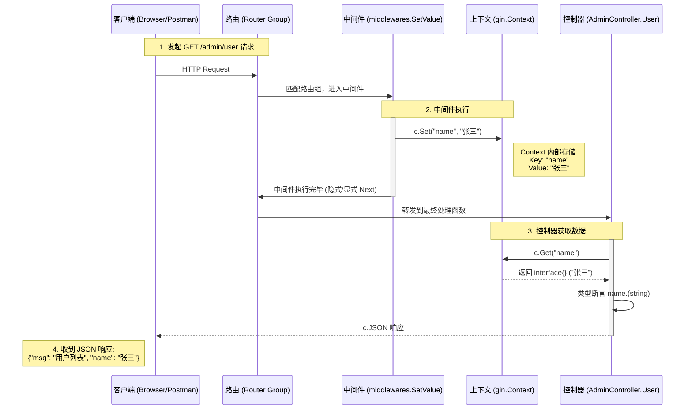

# Gin 中间件与控制器数据共享流程

这个流程图展示了从 HTTP 请求发起，经过中间件设置数据，最后在控制器中获取数据并返回的完整过程。

## 关键步骤说明

1.  **路由匹配**：请求 `/admin/user` 命中 `adminRouters` 路由组。
2.  **中间件执行**：
    *   在进入控制器之前，先执行 `middlewares.SetValue`。
    *   **关键动作**：`c.Set("name", "张三")` 将数据挂载到本次请求的上下文 `gin.Context` 中。就像给这个请求贴了一个标签。
3.  **控制器执行**：
    *   `AdminController.User` 被调用。
    *   **关键动作**：`c.Get("name")` 从上下文中把刚才贴的标签取下来。
4.  **响应**：控制器将取到的数据通过 `c.JSON` 返回给客户端。
